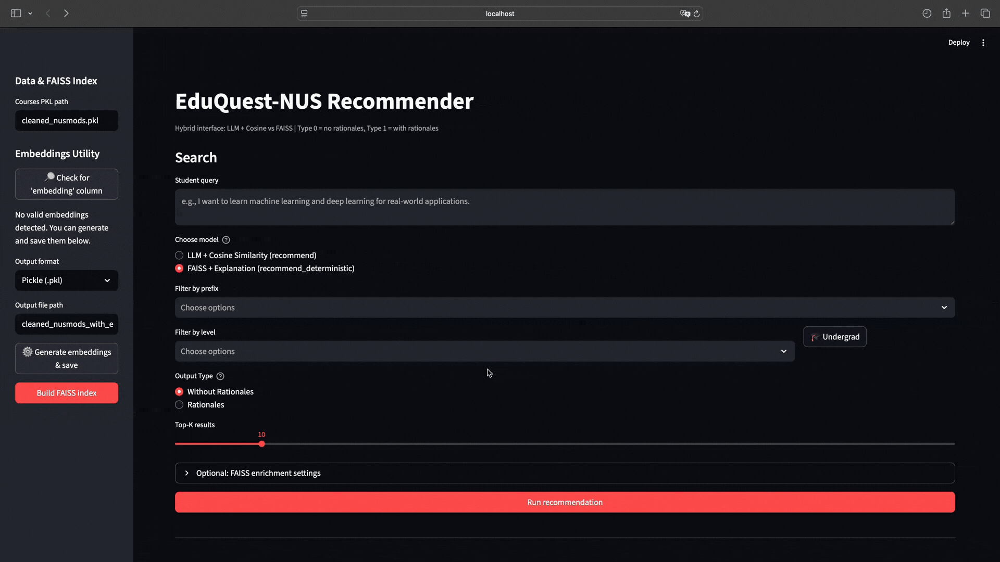

# EduQuest: NLP-Powered Course Recommender

EduQuest helps NUS students discover suitable modules with **free-text queries** that capture intent, not keywords. Instead of literal matching like NUSMods, the system uses LLMs, dense embeddings, and FAISS vector search to understand what the learner is actually looking for. Everything runs **fully locally with vLLM** via OpenAI-compatible endpoints, so no external API calls are required (hosted APIs can be integrated if preferred).

## Table of Contents
1. [Features](#-features)
2. [System Overview](#-system-overview)
3. [Demo](#-demo)
4. [Getting Started](#-getting-started)
5. [Running the UI](#-running-the-ui)
6. [Typical Workflow](#-typical-workflow)
7. [Dataset](#-dataset)

---

## ✨ Features

- 🔍 **Semantic search** finds courses whose descriptions match the intent of a free-form query.
- 🧠 **Query enrichment** rewrites vague prompts with Mistral‑7B for better recall.
- ⚡ **FAISS vector search** enables sub-100 ms retrieval over 9k+ NUS modules.
- 💬 **Optional rationale generation** with Qwen2.5‑7B for natural-language explanations.
- 🖥️ **Streamlit UI** includes prefix/level filters and undergrad quick-select presets.
- 🔒 **Privacy-first, 100% local** using vLLM-hosted models; reproducible experiments.
- 🎯 **Evaluation benchmark** with 25 authentic student queries to measure efficacy.

---

## 🧱 System Overview

| Stage | Tooling | Purpose |
| --- | --- | --- |
| 1. LLM Query Enrichment | Mistral 7B via vLLM | Expand ambiguous queries into richer semantic targets. |
| 2. Embedding Generation | `nomic-embed-text` | Produce dense representations of course descriptions + enriched query. |
| 3. Retrieval | Cosine similarity or FAISS | Return the top‑k semantically similar courses. |
| 4. Explanation (optional) | Qwen2.5 7B-Instruct | Generate natural-language rationales for each recommendation. |

The entire pipeline can run offline. Swap in hosted APIs (OpenAI, Gemini, etc.) if you need stronger models or remote hosting.

---

## 📸 Demo


---

## 🛠 Getting Started

### 1. Clone the repository
```bash
git clone https://github.com/JiachengCJC/EduQuest-NLP_Powered_Course_Recommender.git
cd EduQuest-NLP_Powered_Course_Recommender
```

### 2. Create & activate a virtual environment (Python 3.10.11 recommended)
```bash
python3 -m venv venv
source venv/bin/activate   # macOS / Linux
venv\Scripts\activate      # Windows
```

### 3. Install dependencies
```bash
pip install -r src/requirements.txt
```

### 4. Start vLLM server(s)
Run OpenAI-compatible vLLM endpoints for chat and embeddings.

Install vLLM if needed:
```bash
pip install vllm
```

Text generation server (example):
```bash
vllm serve mistral --host 0.0.0.0 --port 8000 --api-key EMPTY
```

Embedding server (example, can be same or separate host/port):
```bash
vllm serve nomic-embed-text --host 0.0.0.0 --port 8001 --api-key EMPTY --task embed
```

Use the model identifiers that your vLLM servers expose (Hugging Face model IDs or your configured served names).

Then configure your runtime variables (recommended via `.env`):
```bash
cp .env.example .env
# edit .env and set your model names / endpoints
```
The app loads `.env` automatically via `python-dotenv`.

---

## ▶️ Running the UI

Launch the Streamlit interface from the repository root:

```bash
streamlit run src/app.py
```

> The UI will open in your browser (default: http://localhost:8501).

---

## 🧭 Typical Workflow

1. Upload a `.pkl`(cleaned_nusmods_with_embeddings) dataset via the sidebar.
2. Click **Check Embeddings**.  
   - If the uploaded file lacks an `embedding` column, click **Generate Embeddings** (the app will call your configured vLLM embedding model to populate embeddings).
3. Enter a free-text query describing learning goals, interests, or constraints.
4. Choose the retrieval mode:  
   - **LLM + Cosine Similarity**  
   - **FAISS (faster) + optional rationale generation**
5. (Optional) Filter courses by prefix (e.g., `CS`, `IS`) and level (e.g., 1000, 2000).
6. Click **Run Recommendations** to view the ranked recommendations and rationales (if enabled).

---

## 📦 Dataset

The repo ships with a cleaned dataset covering 9,000+ NUS modules:

| Column | Description |
| --- | --- |
| `course` | Course code with prefix (e.g., `CS2103T`). |
| `title` | Official module title. |
| `description` | Synopsis aggregated from NUSMods. |
| `level`(optional) | Numeric level (1000–6000). |
| `prefix`(optional) | Department prefix (CS, IS, GER, etc.). |
| `ori_code` | Legacy/original code if different. |


Files included under `src/`:

- `cleaned_nusmods.pkl`
- `cleaned_nusmods_with_embeddings.pkl`

You can swap in any university dataset so long as it follows the same schema.

---

